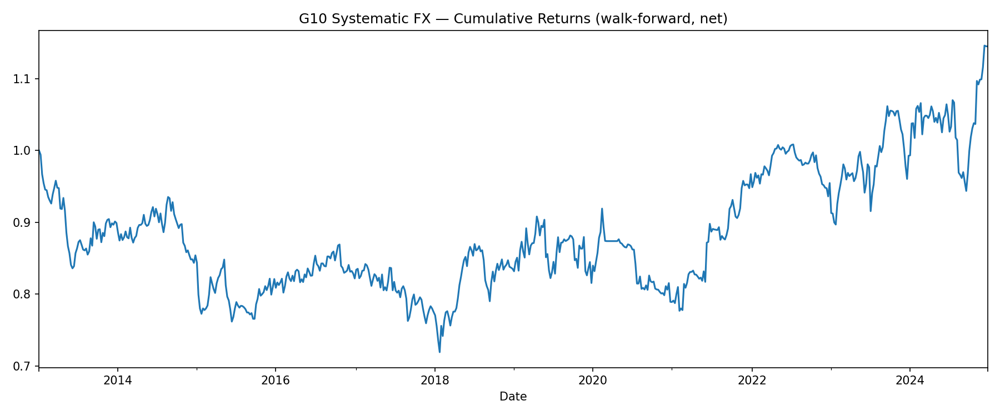

# g10-systematic-fx

Mid-frequency systematic FX strategy across the G10 universe — built end-to-end on **public-only data sources** (FRED, yfinance, CFTC) so the workflow is fully reproducible without a Bloomberg Terminal.

**Stack:** Python · pandas · scipy · statsmodels · yfinance · FRED API · CFTC public reports
**Status:** v1 backtest framework complete; live track record begins post-launch and is committed weekly to `live/track_record/track-record.csv`.

---

## Strategy

A weekly-rebalanced cross-sectional long/short strategy on 9 G10 pairs. Three independent signals are cross-sectionally z-scored, weighted, then gated by a vol-regime filter. Positions are sized to a target portfolio volatility.

| Pillar | Source | Signal |
|---|---|---|
| **Carry** (40%) | FRED — central-bank policy rates | Smoothed annualised rate differential (base − quote) |
| **Momentum** (35%) | yfinance — daily FX spot | Dual-window time-series momentum (21d fast vs 63d slow) |
| **COT positioning** (25%) | CFTC TFF — Leveraged Money | Hedge-fund / CTA net positioning, normalised by open interest |
| **Vol regime** (gate) | yfinance / FRED — VIX | Step-function exposure scalar at the 80th and 95th VIX percentiles |

**Universe:** EURUSD, GBPUSD, AUDUSD, NZDUSD, USDJPY, USDCAD, USDCHF, USDSEK, USDNOK
**Rebalance:** Weekly (Friday close)
**Position sizing:** Vol-targeted, top-3 long / bottom-3 short

---

## v1 backtest result (2013–2024, walk-forward, net of 2 bps round-trip cost)



| Metric | Value |
|---|---|
| Annualised Return | +1.13% |
| Annualised Vol | 11.13% |
| Sharpe | 0.16 |
| Sortino | 0.23 |
| Max Drawdown | -28.08% |
| Hit Rate | 49.68% |
| Periods | 626 weekly |

**Honest read of v1.** This is the baseline result before any signal-construction iteration. Each individual signal (carry, momentum, COT) prints near-zero Sharpe in isolation on this 9-pair universe — the framework is sound, but the naive signal definitions don't have edge in post-GFC G10 FX. The strategy performs well in trending USD regimes (2021, 2024 → Sharpe >1) and gets shredded in reversal years (2013, 2017, 2020). Tracking known gaps publicly so the next commits show the iteration trail.

**Next iterations (in order):**
- Vol-normalise carry: `(rate_diff) / σ_pair` instead of raw rate differential
- Switch momentum to time-series rather than cross-sectional (9 pairs is too thin for cross-section)
- Replace the binary VIX regime filter with a smooth scalar
- Re-weight signals by realised IC rather than priors

---

## Strategies index

For a one-page summary of every strategy with headline metrics, see [**`STRATEGIES.md`**](STRATEGIES.md).

## ⚠️ Critical caveat (2026-06-12)

**Strategy #21 (1-day-extra-lag rigour check on Strategy #1) collapsed the Sharpe from +2.75 to −0.58**, with signal correlation dropping from +0.27 to +0.028. The entire rate-diff family below (Strategies #1–#10, #12, #18) uses the same `d_diff` signal structure and almost certainly contains the same intraday timing leakage between FRED/ECB rate-close timestamps and Yahoo's 5pm ET FX close. Sharpes shown below are **historical-record artefacts, not deployable edges** until rebuilt with properly time-aligned data. The repo is in active reconstruction mode.

## Individual Strategies

Numbered, self-contained single-purpose strategies that emerged from research adjacent to the main framework. Each is a standalone module under [`strategies/`](strategies/) with its own data layer, position rule, and reproducible script.

See [`strategies/README.md`](strategies/README.md) for the full list with results, charts, and caveats.

| # | Title | Apparent Net Sharpe |
|---|---|---|
| 1 ⚠ | Δ(EU 2Y − US 2Y) → next-day EURUSD (**verified timing artefact by #21**) | 2.75 → ⚠ |
| 2 ⚠ | Δ(GB 2Y − US 2Y) → next-day GBPUSD (likely timing artefact) | 1.50 → ⚠ |
| 3 ⚠ | Δ(AU 2Y − US 2Y) → next-day AUDUSD (likely timing artefact) | 1.22 → ⚠ |
| 4 ⚠ | Δ(NZ 2Y − US 2Y) → next-day NZDUSD (likely timing artefact) | 0.92 → ⚠ |
| 5 ⚠ | Δ(US 2Y − JP 2Y) → next-day USDJPY (likely timing artefact) | 1.44 → ⚠ |
| 6 ⚠ | Δ(US 2Y − CA 2Y) → next-day USDCAD (likely timing artefact) | 2.06 → ⚠ |
| 7 | Δ(US 2Y − CH 2Y) → next-day USDCHF (never worked) | 0.00 |
| 8 ⚠ | Δ(US 2Y − SE 2Y) → next-day USDSEK (timing + cost artefact) | 2.13 → ⚠ |
| 9 | Δ(US 2Y − NO 2Y) → next-day USDNOK (deferred — NO 2Y data unavailable) | — |
| **10** ⚠ | Vol-targeted rate-diff portfolio (likely timing artefact) | 2.70 → ⚠ |
| 11 | Cross-sectional momentum portfolio (rejected — see [`strategies/rejected/`](strategies/rejected/)) | −0.34 |
| **12** ⚠ | Calibrated rate-diff portfolio (likely timing artefact) | 2.73 → ⚠ |
| 13 ⚠️ | CFTC positioning extreme + 21-DMA reversal (long+short, 30 trades) | −0.07 |
| 14 ⚠ | Calibrated portfolio + 50-DMA trend filter (degrades signal + timing) | 1.59 → ⚠ |
| 15 ❌ | EURUSD SMA20 + RSI(14) combo (rejected, 49 trades, 24.5% win) | −0.34 |
| 16 ❌ | VIX spike → short USDJPY+USDCHF (rejected, safe-haven thesis broken) | −0.39 |
| 17 ⚠ | Oil (WTI) → next-day USDCAD (verified timing artefact — see #19) | 3.96 → ⚠ |
| **18** ⚠ | Equal-weight rate-diff portfolio (former headline, likely timing artefact) | 2.90 → ⚠ |
| 19 ✓ | Oil → USDCAD with 1-day extra lag (rigour check of #17) | −0.84 |
| 20 ⚠ | Classical vol-normalised carry (LEVEL signal, Dupuy 2021 spec) | 0.07 |
| **21** ✓ | **EURUSD rate-diff with 1-day extra lag (rigour check of #1 — the big finding)** | **−0.58** |
| **22** 🛡️ | **Carry crash filter overlay (VIX + self-momentum) on #18** — Brunnermeier 2009 | **Sharpe flat (2.90→2.91), vol −17%, MaxDD −7%** |
| **23** ❌ | Donchian/ATR breakout with trailing stop (core4, 60d/1.5 ATR/2.5 ATR) — TA-in-FX dead (Park-Irwin 2007) | **−0.18** |
| **24a** ❌ | Classic Turtle Trading System 1 with last-loser filter (20d/10d/2N) — **filter dead-lock**, only 7 trades / 15y | **−0.01** (~flat) |
| **24b** ❌ | Turtle System 1 without filter (pure 20d/10d/2N) — whipsaw graveyard, 689 trades, PF 0.87 | **−0.28** |
| **25** ✓ | **Turtle System 1 on commodities + crypto** (Gold, Silver, Copper, Oil, NatGas, Soy, BTC, ETH) — validates implementation, isolates FX rejection to asset class | **+0.43** (PF 1.36, skew +0.82) |
| **26a** ❌ | Carry-TSMOM filter overlay on #20 (soft, scale 0.5 when 12m carry < 0) | 0.01 (IR −0.18) |
| **26b** ❌ | Carry-TSMOM filter overlay on #20 (hard, scale 0.0 when 12m carry < 0) | −0.06 (IR −0.18) |

---

## Repo structure

```
g10-systematic-fx/
├── config.py                       Universe, FRED series, signal weights, backtest params
├── strategy.py                     G10SystematicFX class + run_full_backtest() entry point
│
├── data/
│   ├── fetchers.py                 FRED (rates, VIX) + yfinance (FX spot)
│   └── cftc.py                     CFTC COT zip downloader and parser
│
├── signals/
│   ├── _base.py                    BaseSignal ABC + cross_section_zscore() helper
│   ├── carry/carry.py              Rate-differential carry signal
│   ├── momentum/momentum.py        Dual-window time-series momentum
│   ├── sentiment/cot.py            CFTC speculator-positioning signal
│   └── vol_regime/vol_regime.py    VIX-based exposure scalar
│
├── backtest/
│   ├── costs.py                    Turnover-based bps cost model
│   ├── metrics.py                  Sharpe, Sortino, max drawdown, Calmar, hit rate
│   └── engine.py                   Walk-forward driver (3y train / 6m test, expanding)
│
├── strategies/
│   └── strat_01_eu_us_2y_diff_eurusd.py   Strategy #1: Δ(EU 2Y − US 2Y) → next-day EURUSD
│
├── notebooks/
│   └── explore_2y_diff_vs_eurusd.py       Exploration regression behind Strategy #1
│
├── reports/                                Equity curves and result PNGs
│
├── live/track_record/
│   └── track-record.csv            Weekly P&L log (committed every Friday post-launch)
│
├── pine/strategy.pine              Pine Script port for TradingView publishing
└── tests/                          14 unit tests, no API key required
```

---

## Setup

```bash
pip install -r requirements.txt

# Get a free FRED API key at https://fred.stlouisfed.org/docs/api/api_key.html
export FRED_API_KEY=your_key_here

# Run the full walk-forward backtest
python strategy.py

# Run unit tests (no API key needed — uses synthetic data)
pytest
```

---

## Backtest methodology

- **Walk-forward:** Expanding-window train/test split, 3 years training / 6 months testing per fold. The strategy can never see future data — train-set data is explicitly truncated at the window boundary inside `backtest/engine.py`.
- **Transaction costs:** 2 bps round-trip applied on actual turnover (sum of absolute weight changes per period).
- **Vol targeting:** Each pair sized inversely to its 21-day realised volatility, scaled to a 10% annualised portfolio target.
- **Stress periods covered:** 2010 EU debt, 2013 taper tantrum, 2015 China devaluation, 2018 Q4, 2020 COVID, 2022 BOJ defence, 2023 SVB cluster.

---

## Data sources

- **FRED** — G10 short-rate series (Fed Funds, ECB DFR, BoE SONIA, OECD 3M for AUD/NZD/JPY/CAD/CHF/SEK/NOK), VIX
- **yfinance** — G10 FX daily spot, VIX fallback
- **CFTC** — Weekly Commitments of Traders, legacy futures-only report, downloaded from `cftc.gov/dea/newcot/`

Bloomberg is the production-grade equivalent used in professional treasury work; this repo runs entirely on public data.

---

## Roadmap

- [x] v1 backtest framework with carry / momentum / COT / vol-regime signals
- [x] Walk-forward harness with realistic costs
- [x] Unit-test coverage on signals + metrics
- [ ] First full historical backtest (post-FRED-key setup)
- [ ] Pine Script port for TradingView Pro+ live publishing
- [ ] Live paper-trading track record (committed every Friday)
- [ ] v2 enhancements: positioning-percentile reversal in COT, smooth vol-regime scalar
