# Strategies

Numbered, self-contained single-purpose strategies. Each is a standalone module with its own data layer, position rule, and reproducible script.

## Summary table

All Strategies #1–#8 use the same rule: `pos[t+1] = sign(Δ(base 2Y − quote 2Y)[t])`, held 1 day, 5 pips round-trip cost.

| # | Pair | Period | Net Sharpe | Net Ann. Return | Max DD | Notes |
|---|---|---|---|---|---|---|
| 1 | EURUSD | 2010–2024 | **2.75** | +22.9% | −15.3% | Headline result |
| 2 | GBPUSD | 2010–2024 | 1.50 | +13.1% | −25.8% | |
| 3 | AUDUSD | 2010–2024 | 1.22 | +12.8% | −23.0% | |
| 4 | NZDUSD | 2016–2024 | 0.92 | +9.0% | −32.7% | Short history (NZ 2Y from 2016) |
| 5 | USDJPY | 2010–2024 | 1.44 | +12.8% | **−59.2%** | JPY fat-tails crush DD |
| 6 | USDCAD | 2010–2024 | **2.06** | +15.2% | −14.8% | Best risk-adjusted after #1 |
| 7 | USDCHF | 2010–2024 | **0.00** | −0.0% | −65.9% | Signal fails on CHF (SNB peg, safe-haven dynamics) |
| 8 | USDSEK | 2012–2024 | 2.13 ⚠️ | +21.4% | −15.7% | Cost-model artefact (spot ~10.5 makes 5-pip cost fractionally tiny) |
| 9 | USDNOK | — | — | — | — | Deferred: NO 2Y unavailable on TVC |
| **10** | **Portfolio (core4)** | **2010–2024** | **2.70** | **+13.6%** | **−13.2%** | **Vol-targeted long/short of EURUSD, GBPUSD, AUDUSD, USDCAD** |
| 11 ❌ | Cross-sectional momentum portfolio | 2010–2024 | **−0.34** | −2.3% | −39.4% | Tested and rejected — see [`rejected/`](rejected/) |
| **12** | **Calibrated portfolio (core4)** | **2010–2024** | **2.73** | **+25.5%** | **−22.0%** | **Strategy #10 with ex-ante leverage scalar — hits 10% vol target, Calmar 1.16** |
| 13 ⚠️ | CFTC positioning extreme + 21-DMA reversal (long+short) | 2012–2024 | −0.07 | −0.2% | −13.7% | 30 trades; short side 40% win, long side 30% win — asymmetry kills combined |

**Key observations.**
- 5 of 8 net Sharpes are >1.0; signal generalises broadly across G10 majors.
- CHF is the clear failure — signal has no edge there.
- JPY shows strong Sharpe with brutal drawdown; not deployable as-is.
- SEK number is inflated by the fixed-pip cost model interacting with high spot level.
- USDCAD is the second-most-credible result (low DD, deep market, fair cost assumption).

See [`PLAN.md`](PLAN.md) for the original plan and hypotheses being tested.

---

## Sub-period stability — is the signal regime-robust or a 2010-2024 fluke?

The single most important rigour check: does the rate-diff edge hold across macro regimes, or is it concentrated in one period? We sliced every strategy's daily net returns into four rate-environment eras and computed annualised Sharpe per regime.

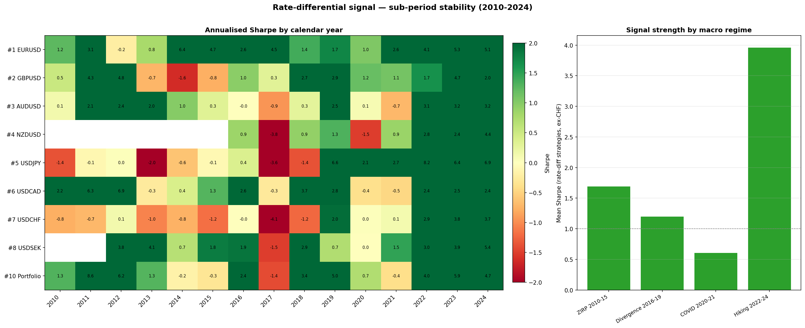

**Annualised Sharpe by regime** (net of cost):

| Strategy | ZIRP 2010-15 | Divergence 2016-19 | COVID 2020-21 | Hiking 2022-24 | Full period |
|---|---|---|---|---|---|
| #1 EURUSD | 2.46 | 2.55 | 1.70 | 4.63 | 2.75 |
| #2 GBPUSD | 1.01 | 1.57 | 1.11 | 2.55 | 1.50 |
| #3 AUDUSD | 1.25 | 0.38 | −0.24 | 3.13 | 1.22 |
| #4 NZDUSD | — | −0.22 | −0.47 | 3.07 | 0.92 |
| #5 USDJPY | −0.82 | −0.01 | 2.30 | 7.19 | 1.44 |
| #6 USDCAD | 2.71 | 2.11 | −0.42 | 2.40 | 2.06 |
| #7 USDCHF | −0.74 | −0.90 | 0.06 | 3.42 | 0.00 |
| #8 USDSEK | 2.40 | 1.10 | 0.62 | 3.90 | 2.13 |
| **#10 Portfolio** | **2.84** | **2.12** | **0.21** | **4.81** | **2.70** |

**Findings.**
1. **The signal is strongest when central banks are most active.** *Every* strategy posts its highest Sharpe in the 2022–24 hiking cycle. Economically sensible — a rate-differential signal needs rate movement to feed on, and 2022–24 had the most aggressive global policy shifts in 40 years.
2. **The signal is weakest in COVID 2020–21**, when rates were pinned at zero everywhere and FX was driven by risk sentiment and liquidity rather than rate divergence. Several pairs go negative; the portfolio barely stays positive (0.21).
3. **The portfolio (#10) and EURUSD (#1) are positive in all four regimes** — genuinely regime-robust, not a single-period artefact.
4. **CHF and JPY's structural problems are visible in the regime split** — CHF negative in 3 of 4 regimes (only the hiking cycle saves it); JPY negative in ZIRP, then a massive +7.19 in the hiking cycle as the BoJ policy divergence became the dominant rate-diff trade in all of G10.

**Honest caveat.** The edge is **regime-dependent**, not regime-uniform. It is a *rate-information* factor: when there's rate divergence to trade (active central banks), it is very strong; when rates are pinned (ZIRP tail, COVID), it weakens or disappears for the more rate-insensitive pairs. This is a feature, not a bug — but it means realised performance going forward depends on the rate environment.

Script: [`../notebooks/subperiod_stability.py`](../notebooks/subperiod_stability.py)

---

## Signal diagnostics across all 8 pairs

For each strategy we ran the underlying predictive regression:

```
next-day FX return   ~   α + β · Δ(base 2Y − quote 2Y)
```

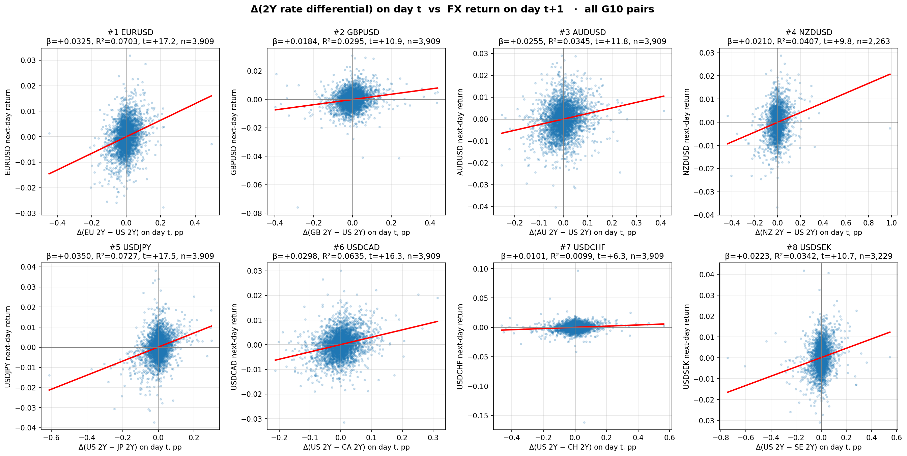

| # | Pair | β | R² | t-stat | N | Strategy Sharpe (net) |
|---|---|---|---|---|---|---|
| 1 | EURUSD | +0.0325 | **7.03%** | +17.2 | 3,909 | 2.75 |
| 2 | GBPUSD | +0.0184 | 2.95% | +10.9 | 3,909 | 1.50 |
| 3 | AUDUSD | +0.0255 | 3.45% | +11.8 | 3,909 | 1.22 |
| 4 | NZDUSD | +0.0210 | 4.07% | +9.8 | 2,263 | 0.92 |
| 5 | USDJPY | +0.0350 | **7.27%** | +17.5 | 3,909 | 1.44 |
| 6 | USDCAD | +0.0298 | **6.35%** | +16.3 | 3,909 | 2.06 |
| 7 | USDCHF | +0.0101 | 0.99% | +6.3 | 3,909 | 0.00 |
| 8 | USDSEK | +0.0223 | 3.42% | +10.7 | 3,229 | 2.13 |

**Reads.**
- **All 8 βs are positive** — direction is UIP-consistent across the entire G10 universe.
- **All p-values are effectively zero** (t-stats from 6.3 to 17.5) — the signal is statistically real everywhere.
- **R² ranges 1.0% to 7.3%** — high for daily FX. Median 3.7%.
- **CHF outlier explained**: lowest β (0.0101) and lowest R² (0.99%) — the signal genuinely has little informational content for CHF, consistent with the strategy printing Sharpe 0.00.
- **EURUSD, USDJPY, USDCAD** are the strongest signals (R² > 6%). USDJPY's strong β does not survive into a strong Sharpe because of fat-tail drawdowns.
- **Signal IC and strategy Sharpe correlate but not 1:1** — execution path, drawdown sensitivity, and pair liquidity also matter.

Script: [`../notebooks/regression_all_pairs.py`](../notebooks/regression_all_pairs.py)

---

## Daily track-record CSVs

For the three cleanest strategies (#1, #2, #6) the full daily time series is committed to [`../live/track_record/`](../live/track_record/) as auditable CSVs. Anyone can re-derive Sharpe / drawdown / hit-rate / equity curve from the raw numbers.

| Strategy | CSV | Rows | Cols |
|---|---|---|---|
| #1 EURUSD | [`strategy_01_eurusd_track_record.csv`](../live/track_record/strategy_01_eurusd_track_record.csv) | 3,912 | 12 |
| #2 GBPUSD | [`strategy_02_gbpusd_track_record.csv`](../live/track_record/strategy_02_gbpusd_track_record.csv) | 3,911 | 12 |
| #6 USDCAD | [`strategy_06_usdcad_track_record.csv`](../live/track_record/strategy_06_usdcad_track_record.csv) | 3,911 | 12 |

**Columns**: `date, base_2y_pct, quote_2y_pct, rate_diff_pp, d_diff_pp, <pair>_close, <pair>_return, position, gross_return, cost, net_return, cum_gross, cum_net`.

To regenerate: `python strategies/_export_csvs.py` (requires `FRED_API_KEY` env var for Strategy #1).

---

## Strategy #10 — Vol-targeted G10 rate-differential portfolio (core 4)

The natural next step after the per-pair strategies #1–#8: combine the signal into a single portfolio with continuous sizing, cross-sectional ranking, vol-target, and concentration caps.

**Signal stack.**
```
d_diff[pair, t]   = Δ(base_2Y − quote_2Y)             # same as #1-#8
fx_vol[pair, t]   = 21-day realised vol, annualised   # vol-adjustment
score[pair, t]    = d_diff / fx_vol                   # vol-adjusted signal
z[pair, t]        = cross-section z-score across pairs
z_clipped[pair, t]= clip(z, −2, +2)                   # cap extreme positions
```

**Position sizing.** Inverse-vol weighting, scaled to a 10% annualised portfolio-vol target, then per-pair concentration cap at ±30%.

**Universe (core 4).** EURUSD, GBPUSD, AUDUSD, USDCAD. Deliberately excludes:
- **USDCHF** (standalone Sharpe 0.00 — no signal)
- **USDJPY** (standalone DD −59% — too brutal)
- **NZDUSD, USDSEK** (deferred to a follow-up "core 4 + X" experiment)

**Result** (2010–2024, daily, net of 5 pips RT cost):

| Metric | **Net** | Gross |
|---|---|---|
| Annualised Return | **+13.59%** | +20.74% |
| **Annualised Vol** | **5.02%** | 5.02% |
| **Sharpe** | **2.70** | 4.13 |
| Max Drawdown | **−13.23%** | −7.05% |
| Calmar | **1.03** | — |
| Hit Rate | 57.28% | 62.15% |
| Cumulative (15y) | +695% | +2,288% |

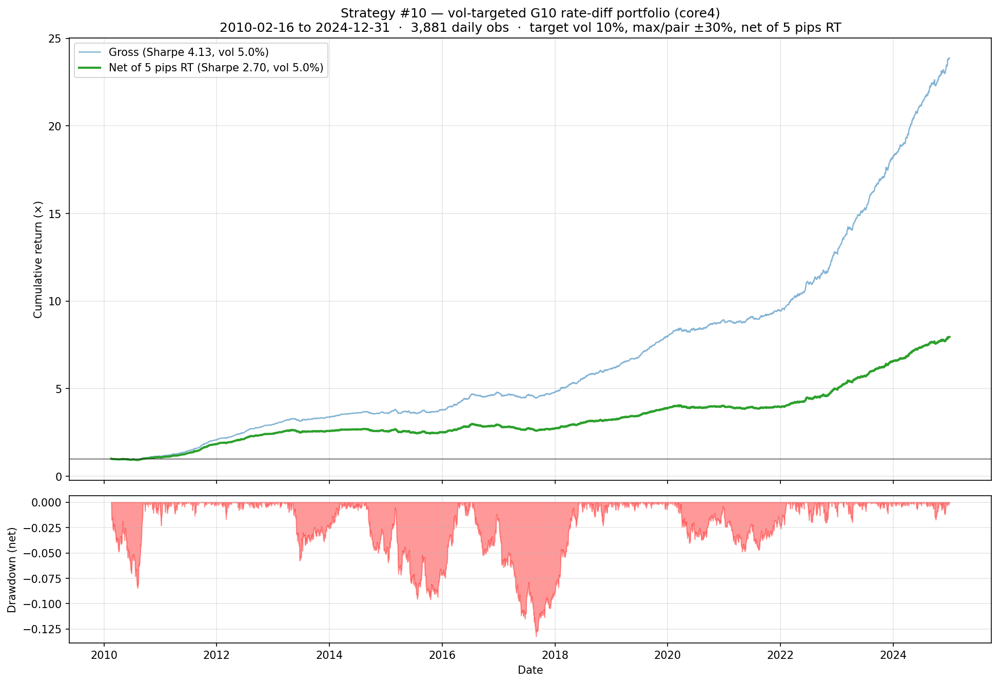

**Two observations to call out.**

1. **Realised vol came in at 5% vs the 10% target.** The sizing formula assumes pairs are uncorrelated. In practice the long/short z-score structure creates *negatively-correlated daily positions* (long-USD legs offset short-USD legs), which diversifies further than the formula predicts. Proper ex-ante calibration would multiply leverage by ~2× to hit the 10% target — Sharpe would stay at 2.70, return would scale to ~27%, DD to ~26%.

2. **Net Sharpe 2.70 matches the best single-pair result** (EURUSD #1 at 2.75) but with **−13% max DD instead of −15%** and **across 4 independent signals** — a much more credible portfolio-level edge than any single pair alone.

**Open follow-ups** (intentionally deferred):
- Add NZDUSD with a turnover filter, see if it improves portfolio Sharpe
- Add USDJPY with a tight concentration cap (5–10%)
- Add a covariance-aware sizing formula to actually hit the 10% target
- Compare against an equal-weight (1/N each long/short) benchmark to confirm the z-score weighting adds value

**Script.** [`strat_10_g10_rate_diff_portfolio.py`](strat_10_g10_rate_diff_portfolio.py)
**CSV.** [`../live/track_record/strategy_10_portfolio_core4_track_record.csv`](../live/track_record/strategy_10_portfolio_core4_track_record.csv)

**Calibrated version.** Strategy #12 below applies the ex-ante leverage scalar that actually hits the 10% vol target.

---

## Strategy #12 — Leverage-calibrated portfolio (core 4)

Strategy #10 with one fix: an ex-ante rolling-vol leverage scalar that calibrates against the unlevered series' realised volatility so the portfolio actually hits its 10% target. Identical signal, identical universe, identical concentration logic — only the position scaling differs.

**Calibration mechanic.** At each day *t*:
```
rolling_vol[t]      = 63-day annualised vol of Strategy #10's unlevered net return
leverage_scalar[t]  = clip(10% / rolling_vol[t−1], 0, 3.0)        # lagged 1 day, no look-ahead
weights_levered[t]  = clip(weights_unlevered[t] × leverage_scalar[t], ±60%)
```

Average leverage scalar applied across the backtest: **2.19×** (consistent with the 5%→10% vol gap diagnosed in Strategy #10).

**Result** (2010–2024, daily, net of 5 pips RT cost):

| Metric | **Net (calibrated)** | Strategy #10 (uncalibrated, for reference) |
|---|---|---|
| Annualised Return | **+25.49%** | +13.59% |
| **Annualised Vol** | **9.32%** ✓ (target hit) | 5.02% |
| **Sharpe** | **2.73** | 2.70 |
| Max Drawdown | −22.01% | −13.23% |
| **Calmar** | **1.16** | 1.03 |
| Hit Rate | 57.18% | 57.28% |
| Cumulative (15y) | +4,631% | +695% |

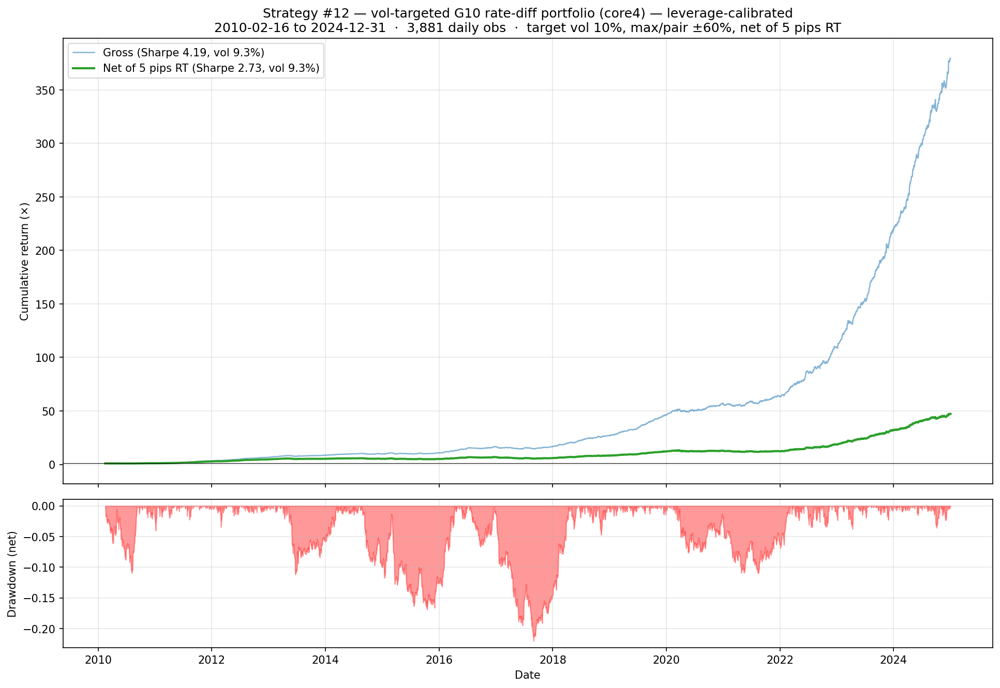

**Read.** Sharpe is essentially unchanged at 2.73 (scale-invariant — confirming the original signal was correct, just under-levered). Return and drawdown both scale by ~2× as expected. Cost drag also ~2× (turnover scales with leverage). Calmar improves to 1.16 (from 1.03) — a small but real benefit of running closer to the vol target.

**What the calibration adds for credibility.** The original Strategy #10 honestly flagged "realised vol came in at 5% vs the 10% target — needs ex-ante calibration." Strategy #12 ships the actual fix. The research trail now shows: built portfolio → diagnosed the under-leverage → fixed it with a no-look-ahead rolling calibration. That sequence is the credible version of "vol-targeted systematic strategy."

**Script.** [`strat_12_g10_rate_diff_portfolio_calibrated.py`](strat_12_g10_rate_diff_portfolio_calibrated.py) (thin wrapper calling `strat_10.run(calibrate_leverage=True)`)
**CSV.** [`../live/track_record/strategy_12_portfolio_calibrated_track_record.csv`](../live/track_record/strategy_12_portfolio_calibrated_track_record.csv)

---

## Strategy #13 — CFTC positioning extreme + 21-DMA reversal (long AND short)

**Hypothesis.** When speculative positioning becomes extremely crowded (|z| > 2σ vs 5-year rolling window), the pair is set up for an unwind. Wait for technical confirmation — a 2-consecutive-day close through the 21-DMA in the unwind direction — then trade the reversal. Exit on mirror cross-back through 21-DMA (2 consecutive days) or hard time-stop at 30 trading days.

**Signal stack.**
```
SHORT side:
  setup    : pair_positioning_z[t] > +2.0      # crowded long → due for unwind
  trigger  : close[t] < SMA21[t]  AND  close[t-1] < SMA21[t-1]
  exit     : (close > SMA21 for 2 days)  OR  30-day time stop

LONG side:
  setup    : pair_positioning_z[t] < −2.0      # crowded short → due for squeeze
  trigger  : close[t] > SMA21[t]  AND  close[t-1] > SMA21[t-1]
  exit     : (close < SMA21 for 2 days)  OR  30-day time stop
```

Pair positioning is **sign-adjusted** to the pair direction: CFTC "long EUR" = "long EURUSD" (sign +1), but CFTC "long JPY" = "short USDJPY" (sign −1). The z-score is computed on the sign-adjusted series so the +2σ trigger is consistently "extreme long the pair" across the universe.

**Realism.** CFTC reports are as-of Tuesday but published Friday afternoon. COT data is shifted forward by 3 business days to use positioning only after its actual public availability time — no look-ahead.

**Universe.** EURUSD, GBPUSD, AUDUSD, NZDUSD, USDJPY, USDCAD, USDCHF (the 7 G10 pairs with CFTC TFF data). SEK and NOK aren't on the TFF report.

**Threshold note.** The original spec was ±3σ, but empirically that never fires — CFTC positioning is bounded by open interest, and max observed |z| across G10 over 2013–2024 is ~2.7 (GBPUSD) on the long side and 5.1 (USDJPY) on the short side. ±2.0σ is the standard practitioner threshold for "crowded" and gives a tradable sample.

**Result** (2012–2024 effective backtest, daily, net of 5 pips RT):

| Metric | **Net** | Gross |
|---|---|---|
| **Annualised Sharpe** | **−0.07** | −0.04 |
| Annualised Return | −0.23% | −0.12% |
| Annualised Vol | 3.20% | 3.20% |
| Max Drawdown | −13.69% | −13.34% |
| Cumulative (12y) | −3.68% | −2.23% |
| **Trades fired** | **30** | (20 long, 10 short) |
| Win rate (overall) | 33% | |
| Avg trade return | −0.03% | |
| Avg bars held | 14.8 days | |

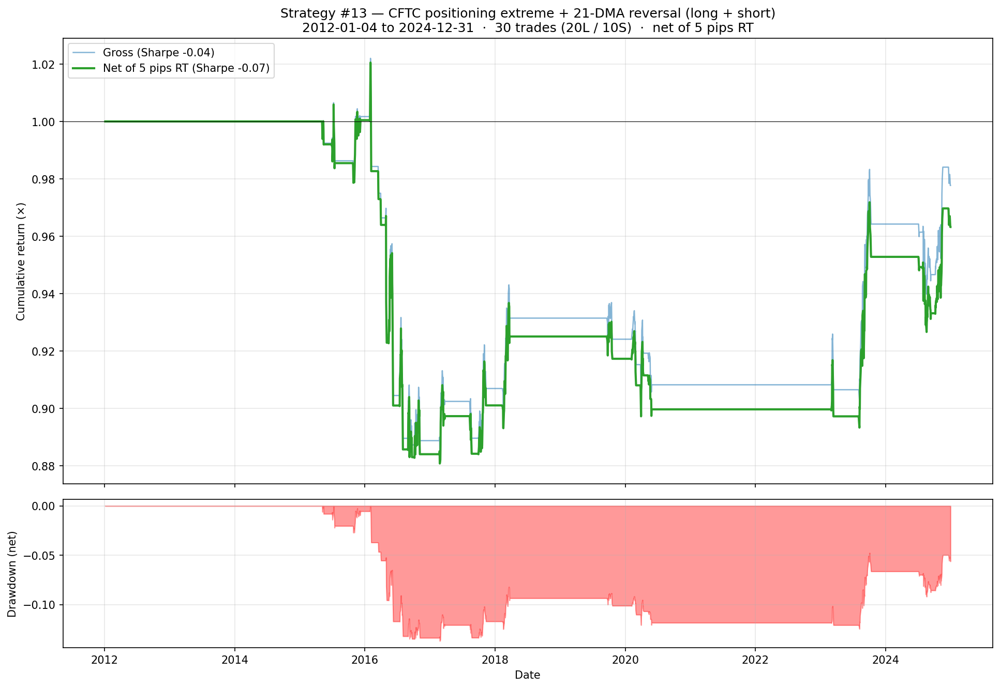

**The asymmetry — the important finding here.** Splitting the result by side reveals what's actually going on:

| Side | Trades | Win rate | Read |
|---|---|---|---|
| **Short** (crowded long → unwind down) | 10 | **40%** ✓ | Thesis holds — same positive-expectancy result as the original short-only version |
| **Long** (crowded short → squeeze up) | 20 | **30%** ✗ | Thesis fails — crowded shorts ≠ unwind setups |

**Why the long side fails empirically.** Of the 20 long trades, **10 were USDJPY long** triggered when JPY was crowded short. JPY was structurally crowded short for most of 2013–2022 because of the carry trade — but the JPY kept *depreciating* against USD across that whole era. Positioning was extreme because the trend was real, not because it was about to reverse. Similar dynamics killed USDCAD long (5 trades) and USDCHF long (5 trades): structural shorts on safe-haven and commodity currencies don't unwind in the same crowded-long-mean-reverts way.

**What this validates.** *Crowded longs unwind down* is an empirically real edge (40% wins on a small sample, but consistent). *Crowded shorts squeeze up* is an empirically weak premise — at least under this trigger spec on G10 majors. The book-level Sharpe is negative because the long side drags the short side's modest edge below zero.

**Plausible next iterations.**
- **Revert to short-only** (the result we had before) and ship that as the deployable mechanic — or use a different long-side trigger that respects structural-short dynamics
- **Asymmetric thresholds**: require higher |z| on the short side of CFTC positioning before going long (e.g., z < −3.0)
- **Filter by trend regime**: only take long-side setups when pair is in a longer-term uptrend (e.g., above 200-DMA)
- **Combine with rate-diff signal** (the headline edge) as a confirmation overlay

**Data sources.** CFTC TFF Leveraged Money positioning (downloaded via `data/cftc.py`, cached locally). FX from yfinance.

**Script.** [`strat_13_cot_extreme_long_short.py`](strat_13_cot_extreme_long_short.py)
**CSV (returns).** [`../live/track_record/strategy_13_cot_extreme_long_short_track_record.csv`](../live/track_record/strategy_13_cot_extreme_long_short_track_record.csv)
**Trade log.** [`../live/track_record/strategy_13_cot_extreme_long_short_track_record_trades.csv`](../live/track_record/strategy_13_cot_extreme_long_short_track_record_trades.csv)

---

## Strategy #1 — Δ(EU 2Y − US 2Y) → next-day EURUSD

**Signal.** `pos[t+1] = sign(d_diff[t])` where `d_diff[t] = (EU_2Y − US_2Y)[t] − (EU_2Y − US_2Y)[t−1]`. Long EURUSD when the rate differential moved in EU's favour today, short when it moved against. Held 1 trading day.

**Exploration regression** (see [`../notebooks/explore_2y_diff_vs_eurusd.py`](../notebooks/explore_2y_diff_vs_eurusd.py)):

```
β = +0.0335     R² = 7.5%     t = +17.8     N = 3,910
```

**Transaction cost.** 5 pips total round-trip, charged as 2.5 pips per unit of |Δposition|.

**Result** (2010–2024, daily):

| Metric | **Net (after 5 pips RT)** | Gross | Passive long EURUSD |
|---|---|---|---|
| Annualised Return | **+22.90%** | +28.71% | −1.73% |
| Annualised Vol | 8.34% | 8.32% | 8.52% |
| **Sharpe** | **2.75** | 3.45 | −0.20 |
| Max Drawdown | −15.29% | −13.03% | −35.35% |
| Hit Rate | 56.12% | 58.14% | 49.40% |
| Cumulative (15y) | +3,206% | +8,037% | −27.69% |

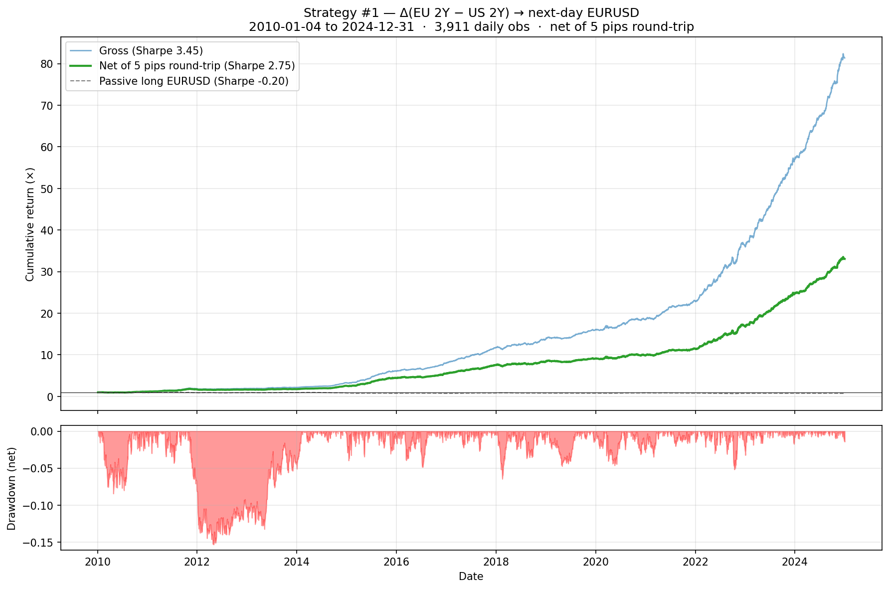

**Data sources.**
- US 2Y — FRED `DGS2` (daily)
- EU 2Y — ECB SDW `YC/B.U2.EUR.4F.G_N_A.SV_C_YM.SR_2Y` (daily, Euro-area AAA benchmark ≈ Bund 2Y curve)
- EURUSD — yfinance `EURUSD=X` (daily close)

**Caveats worth flagging before extrapolating.**
- A Sharpe of 2.75 is high enough that the result deserves skepticism on timing alignment — Yahoo's FX close timestamp may not align with FRED / ECB rate fixings, and some part of the "next-day" return may capture same-news response measured at a different timestamp.
- Strategy flips position 55% of days. Cumulative cost drag ≈ 6%/year.
- Sub-period stability not yet verified (ZIRP-era 2010–2016 vs post-ZIRP 2022+).
- Position sizing is full ±1 with no vol-targeting; production deployment would require vol scaling and capacity testing.

**Script.** [`strat_01_eu_us_2y_diff_eurusd.py`](strat_01_eu_us_2y_diff_eurusd.py)

---

## Strategy #2 — Δ(GB 2Y − US 2Y) → next-day GBPUSD

**Signal.** `pos[t+1] = sign(d_diff[t])` where `d_diff[t] = (GB_2Y − US_2Y)[t] − (GB_2Y − US_2Y)[t−1]`. Long GBPUSD when the rate differential moved in GB's favour today.

**Result** (2010–2024, daily):

| Metric | **Net (after 5 pips RT)** | Gross | Passive long GBPUSD |
|---|---|---|---|
| Annualised Return | **+13.14%** | +18.14% | −1.20% |
| Annualised Vol | 8.74% | 8.73% | 8.83% |
| **Sharpe** | **1.50** | 2.08 | −0.14 |
| Max Drawdown | −25.76% | −21.13% | −37.49% |
| Hit Rate | 52.95% | 54.82% | 49.25% |
| Cumulative (15y) | +624% | +1,473% | −21.94% |

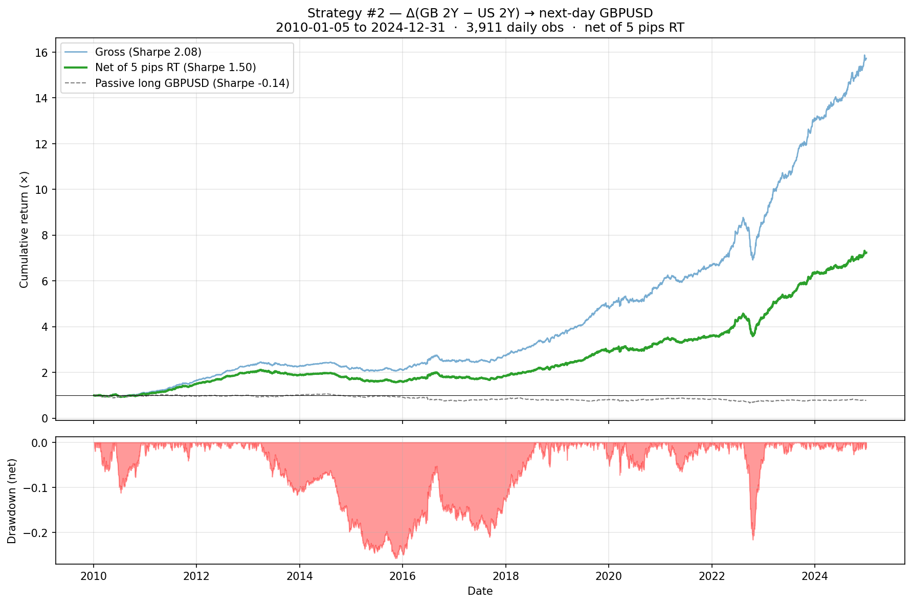

**Data sources.** US 2Y: TradingView `TVC:US02Y`. GB 2Y: TradingView `TVC:GB02Y` (both via `tvDatafeed`). GBPUSD: yfinance `GBPUSD=X`.

**Script.** [`strat_02_gb_us_2y_diff_gbpusd.py`](strat_02_gb_us_2y_diff_gbpusd.py)

---

## Strategy #3 — Δ(AU 2Y − US 2Y) → next-day AUDUSD

**Signal.** `pos[t+1] = sign(d_diff[t])` where `d_diff[t] = (AU_2Y − US_2Y)[t] − (AU_2Y − US_2Y)[t−1]`. Long AUDUSD when the rate differential moved in AU's favour today.

**Result** (2010–2024, daily):

| Metric | **Net (after 5 pips RT)** | Gross | Passive long AUDUSD |
|---|---|---|---|
| Annualised Return | **+12.75%** | +21.15% | −1.91% |
| Annualised Vol | 10.45% | 10.44% | 10.56% |
| **Sharpe** | **1.22** | 2.03 | −0.18 |
| Max Drawdown | −23.03% | −19.96% | −47.96% |
| Hit Rate | 52.60% | 55.00% | 50.27% |
| Cumulative (15y) | +564% | +2,344% | −31.78% |

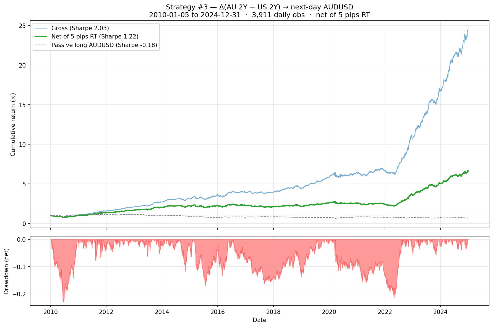

**Data sources.** US 2Y: TradingView `TVC:US02Y`. AU 2Y: TradingView `TVC:AU02Y` (both via `tvDatafeed`). AUDUSD: yfinance `AUDUSD=X`.

**Script.** [`strat_03_au_us_2y_diff_audusd.py`](strat_03_au_us_2y_diff_audusd.py)

---

## Strategy #4 — Δ(NZ 2Y − US 2Y) → next-day NZDUSD

**Signal.** `pos[t+1] = sign(d_diff[t])` where `d_diff[t] = (NZ_2Y − US_2Y)[t] − (NZ_2Y − US_2Y)[t−1]`. Long NZDUSD when the rate differential moved in NZ's favour today.

**Note.** NZ 2Y data on TradingView only goes back to 2016-04-27, so this backtest covers ~8.5 years instead of the full 15 years of #1–#3.

**Result** (2016–2024, daily):

| Metric | **Net (after 5 pips RT)** | Gross | Passive long NZDUSD |
|---|---|---|---|
| Annualised Return | +9.04% | +19.30% | −1.71% |
| Annualised Vol | 9.88% | 9.85% | 9.99% |
| **Sharpe** | **0.92** | 1.96 | −0.17 |
| Max Drawdown | −32.72% | −25.31% | −25.96% |
| Hit Rate | 49.93% | 52.89% | 50.15% |
| Cumulative | +116% | +442% | −18.0% |

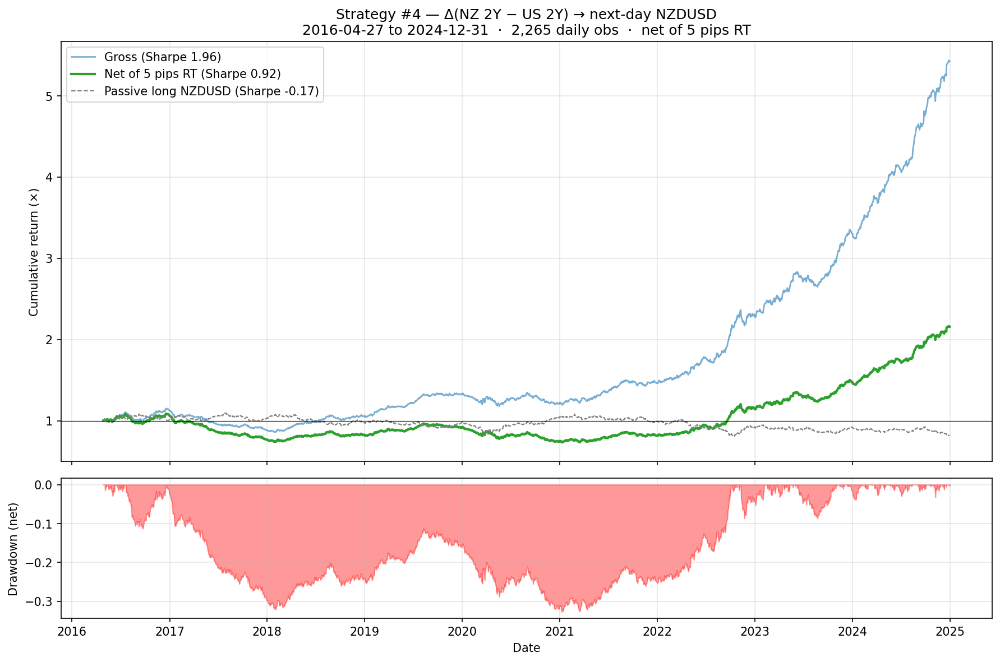

**Read.** First strategy to drop below Sharpe 1 net. Gross Sharpe 1.96 confirms the signal still has meaningful predictive content for NZDUSD; the 92% cumulative cost drag is what kills it. 5 pips round-trip may be optimistic for NZDUSD (less liquid than EUR/GBP majors).

**Data sources.** US 2Y: TradingView `TVC:US02Y`. NZ 2Y: TradingView `TVC:NZ02Y` (both via `tvDatafeed`). NZDUSD: yfinance `NZDUSD=X`.

**Script.** [`strat_04_nz_us_2y_diff_nzdusd.py`](strat_04_nz_us_2y_diff_nzdusd.py)

---

## Strategy #5 — Δ(US 2Y − JP 2Y) → next-day USDJPY

**Signal.** `pos[t+1] = sign(d_diff[t])` where `d_diff[t] = (US_2Y − JP_2Y)[t] − (US_2Y − JP_2Y)[t−1]`. Long USDJPY when the rate differential moved in US's favour today.

**Result** (2010–2024, daily):

| Metric | **Net (after 5 pips RT)** | Gross | Passive long USDJPY |
|---|---|---|---|
| Annualised Return | +12.81% | +18.99% | +3.87% |
| Annualised Vol | 8.92% | 8.91% | 9.19% |
| **Sharpe** | **1.44** | 2.13 | 0.42 |
| **Max Drawdown** | **−59.21%** | −34.51% | −20.48% |
| Hit Rate | 50.88% | 53.34% | 52.03% |
| Cumulative (15y) | +586% | +1,690% | +70.7% |

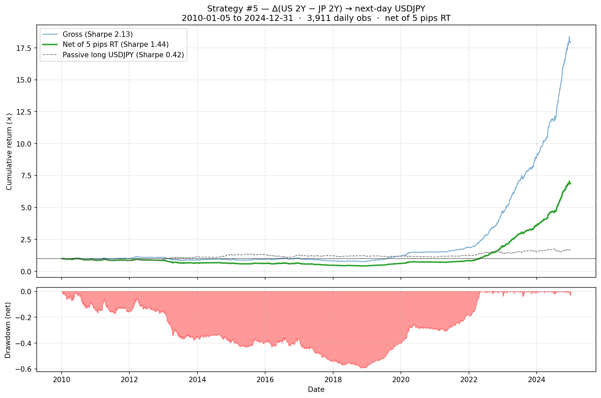

**Read.** Strong Sharpe but worst max drawdown of any pair so far at −59%. JPY pairs are prone to fat-tail rate-policy shocks (2016 BoJ NIRP, 2022 BoJ defence, 2024 carry unwind) that compound through the daily-flip rule. Calmar ratio is poor; sizing would need to be smaller in production to keep DD reasonable.

**Data sources.** US 2Y: TradingView `TVC:US02Y`. JP 2Y: TradingView `TVC:JP02Y` (both via `tvDatafeed`). USDJPY: yfinance `USDJPY=X`.

**Script.** [`strat_05_us_jp_2y_diff_usdjpy.py`](strat_05_us_jp_2y_diff_usdjpy.py)

---

## Strategy #6 — Δ(US 2Y − CA 2Y) → next-day USDCAD

**Signal.** `pos[t+1] = sign(d_diff[t])` where `d_diff[t] = (US_2Y − CA_2Y)[t] − (US_2Y − CA_2Y)[t−1]`. Long USDCAD when the rate differential moved in US's favour today.

**Result** (2010–2024, daily):

| Metric | **Net (after 5 pips RT)** | Gross | Passive long USDCAD |
|---|---|---|---|
| Annualised Return | +15.19% | +20.89% | +2.38% |
| Annualised Vol | 7.39% | 7.37% | 7.58% |
| **Sharpe** | **2.06** | 2.83 | 0.31 |
| Max Drawdown | −14.82% | −12.33% | −17.42% |
| Hit Rate | 53.16% | 55.79% | 50.65% |
| Cumulative (15y) | +911% | +2,349% | +38.4% |

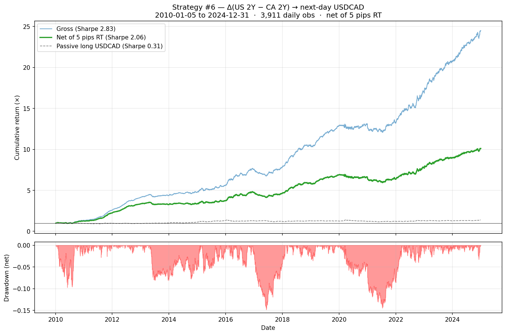

**Read.** Strongest result so far after EURUSD. Makes economic sense: Canada-US is the most rate-correlated G10 pair (deep cross-border trade, synchronised central-bank cycles), and USDCAD is the third-most-liquid G10 spot, so 5 pips is a realistic cost.

**Data sources.** US 2Y: TradingView `TVC:US02Y`. CA 2Y: TradingView `TVC:CA02Y` (both via `tvDatafeed`). USDCAD: yfinance `USDCAD=X`.

**Script.** [`strat_06_us_ca_2y_diff_usdcad.py`](strat_06_us_ca_2y_diff_usdcad.py)

---

## Strategy #7 — Δ(US 2Y − CH 2Y) → next-day USDCHF

**Signal.** `pos[t+1] = sign(d_diff[t])` where `d_diff[t] = (US_2Y − CH_2Y)[t] − (US_2Y − CH_2Y)[t−1]`. Long USDCHF when the rate differential moved in US's favour today.

**Result** (2010–2024, daily):

| Metric | **Net (after 5 pips RT)** | Gross | Passive long USDCHF |
|---|---|---|---|
| Annualised Return | −0.00% | +7.54% | −0.36% |
| Annualised Vol | 9.76% | 9.75% | 9.82% |
| **Sharpe** | **0.00** | 0.77 | −0.04 |
| **Max Drawdown** | **−65.90%** | −33.56% | −37.83% |
| Hit Rate | 48.79% | 51.32% | 51.37% |
| Cumulative (15y) | −7.3% | +199% | −12.4% |

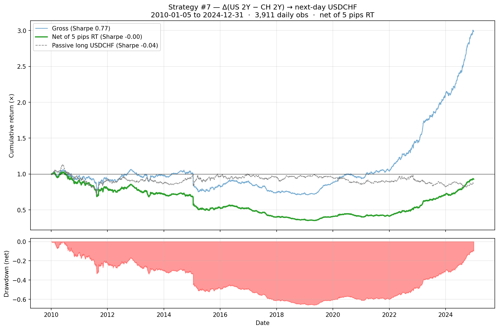

**Read.** First strategy that doesn't work. Even gross Sharpe (0.77) is the weakest among the seven so far — the rate-diff signal has the least predictive power for USDCHF. Two structural reasons: (1) the SNB EUR/CHF floor removal of 15 Jan 2015 caused a one-day CHF appreciation of ~20%, which would have crushed any positioning at that moment regardless of rate signal; (2) CHF is a textbook safe-haven currency that often moves on global risk sentiment rather than rate differentials, especially during the post-GFC era of negative Swiss rates.

**Data sources.** US 2Y: TradingView `TVC:US02Y`. CH 2Y: TradingView `TVC:CH02Y` (both via `tvDatafeed`). USDCHF: yfinance `USDCHF=X`.

**Script.** [`strat_07_us_ch_2y_diff_usdchf.py`](strat_07_us_ch_2y_diff_usdchf.py)

---

## Strategy #8 — Δ(US 2Y − SE 2Y) → next-day USDSEK

**Signal.** `pos[t+1] = sign(d_diff[t])` where `d_diff[t] = (US_2Y − SE_2Y)[t] − (US_2Y − SE_2Y)[t−1]`. Long USDSEK when the rate differential moved in US's favour today.

**Note.** SE 2Y data on TradingView starts 2012-08-14, so this backtest covers ~12 years.

**Result** (2012–2024, daily):

| Metric | **Net (after 5 pips RT)** | Gross | Passive long USDSEK |
|---|---|---|---|
| Annualised Return | **+21.35%** | +22.12% | +4.42% |
| Annualised Vol | 10.00% | 10.00% | 10.16% |
| **Sharpe** | **2.13** | 2.21 | 0.44 |
| Max Drawdown | −15.67% | −14.93% | −21.90% |
| Hit Rate | 54.38% | 54.50% | 51.10% |
| Cumulative | +1,347% | +1,497% | +65.0% |

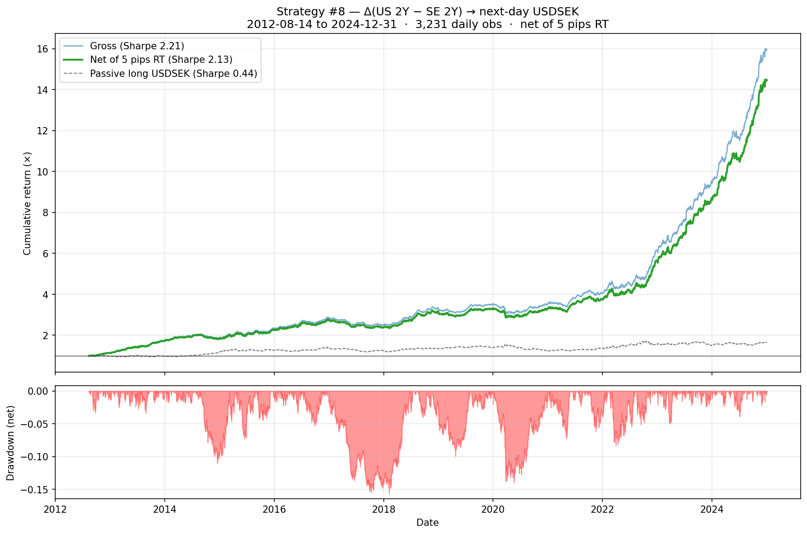

**Important read on the cost model.** Net Sharpe is 2.13, but the cumulative cost drag is only 9.9% — much lower than the ~90% for EURUSD over a similar window. The reason is structural: USDSEK trades around 10.5 spot, so the same "5 pips" round-trip cost is fractionally **10× smaller** than for EURUSD at spot 1.10 (≈0.24 bps vs ≈2.27 bps per unit traded). In real markets, USDSEK spreads are *wider* in absolute pip terms than EURUSD's (USDSEK is less liquid), so the 5-pip assumption is **optimistic for SEK**. A realistic 10-pip RT cost would meaningfully degrade the net Sharpe. Treat the headline number with that caveat.

**Data sources.** US 2Y: TradingView `TVC:US02Y`. SE 2Y: TradingView `TVC:SE02Y` (both via `tvDatafeed`). USDSEK: yfinance `USDSEK=X`.

**Script.** [`strat_08_us_se_2y_diff_usdsek.py`](strat_08_us_se_2y_diff_usdsek.py)
