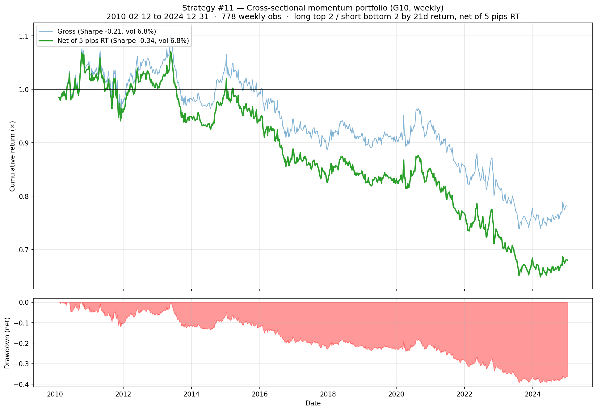

# Rejected Strategies

Strategies that were tested but did **not** show net positive Sharpe in the backtest. Kept in the repo for honest research-trail purposes — the credibility narrative is meant to include what didn't work, not just what did.

Each rejected strategy still has:
- A reproducible script (same conventions as `strategies/`)
- Full equity-curve PNG in [`../reports/rejected/`](../../reports/rejected/)
- A daily/weekly track-record CSV in [`../../live/track_record/rejected/`](../../live/track_record/rejected/)
- Honest documentation of *why* it failed

---

## Strategy #11 — Cross-sectional momentum portfolio (weekly)

**Signal.** At each Friday close, compute each pair's 21-day trailing return. Rank the 8 G10 pairs by this return. Long the top 2 (+0.25 each), short the bottom 2 (−0.25 each). Hold 1 trading week. Re-rank next Friday.

**Result** (2010–2024, weekly, net of 5 pips RT):

| Metric | **Net** | Gross |
|---|---|---|
| Annualised Return | **−2.34%** | −1.42% |
| Annualised Vol | 6.84% | 6.81% |
| **Sharpe** | **−0.34** | −0.21 |
| Max Drawdown | −39.39% | −32.97% |
| Hit Rate | 50.90% | 51.29% |
| Calmar | −0.06 | — |
| Cumulative (15y) | **−31.97%** | −21.86% |

**Why it failed.** Cross-sectional FX momentum was profitable in the 1990s and 2000s but has been **flat-to-negative since the 2008 GFC**. Multiple effects are cited in the literature:

- **HFT / algo arbitrage** of short-term trends within hours instead of weeks
- **Central-bank coordination** since 2010 dampening sustained currency trends
- **ZIRP-era convergence** removing the carry-driven trends that fuelled FX momentum
- **Factor crowding** — too many CTAs running the same signal

The canonical Asness-Moskowitz-Pedersen "Value and Momentum Everywhere" (2013) used data ending around 2010. Out-of-sample tests on 2010+ data have repeatedly shown the FX momentum factor flat or negative — which is exactly our backtest period.

**What this validates.** That **rate-differential change is a genuinely different signal than price momentum** — they look superficially similar (both react to recent price/rate moves) but rate-diff predicts next-day FX positively (Strategies #1–#8, #10) while price momentum predicts it neutrally-to-negatively. This is consistent with the under-reaction-to-fundamentals story: rate moves reflect fresh policy information that hasn't fully diffused into FX yet, whereas price moves are already-reflected information.

**What might rescue it (untested as of this commit).**
- **Longer lookback** (63d or 252d): the literature's standard momentum windows are 3-12 months. 21 days is short. Worth one targeted test.
- **Time-series version**: each pair on its own merits (long if positive, short if negative) instead of cross-sectional ranking. Sometimes TS survives when XS fails.
- **Vol-managed momentum** (Barroso-Santa-Clara 2015): scale signal by recent realised vol. Generally improves momentum strategies after costs.

**Sources.** FX prices: yfinance `EURUSD=X` etc. No external rate data needed.

**Script.** [`strat_11_g10_momentum_portfolio.py`](strat_11_g10_momentum_portfolio.py)
**Equity curve.** [`reports/rejected/strategy_11_g10_momentum_portfolio.png`](../../reports/rejected/strategy_11_g10_momentum_portfolio.png)
**Track-record CSV.** [`live/track_record/rejected/strategy_11_momentum_portfolio_track_record.csv`](../../live/track_record/rejected/strategy_11_momentum_portfolio_track_record.csv)
