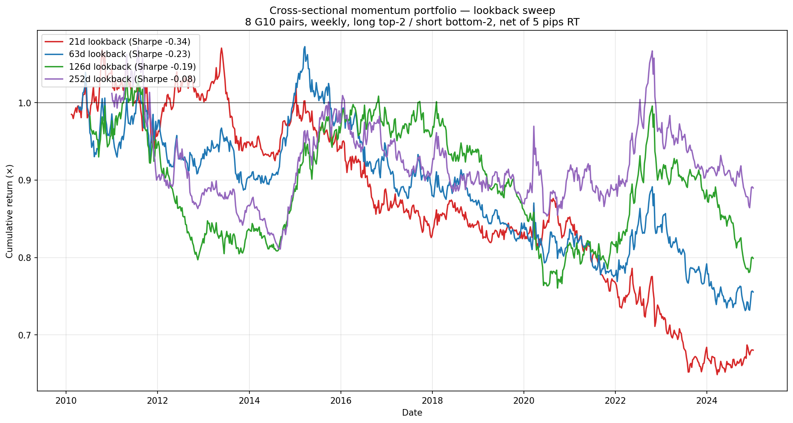
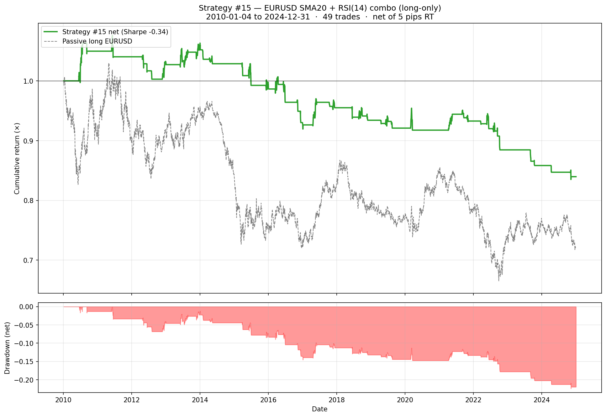

# Rejected Strategies

Strategies that were tested but did **not** show net positive Sharpe in the backtest. Kept in the repo for honest research-trail purposes — the credibility narrative is meant to include what didn't work, not just what did.

Each rejected strategy still has:
- A reproducible script (same conventions as `strategies/`)
- Full equity-curve PNG in [`../reports/rejected/`](../../reports/rejected/)
- A daily/weekly track-record CSV in [`../../live/track_record/rejected/`](../../live/track_record/rejected/)
- Honest documentation of *why* it failed

---

## Strategy #11 — Cross-sectional momentum portfolio (weekly)

**Signal.** At each Friday close, compute each pair's 21-day trailing return. Rank the 8 G10 pairs by this return. Long the top 2 (+0.25 each), short the bottom 2 (−0.25 each). Hold 1 trading week. Re-rank next Friday.

**Result** (2010–2024, weekly, net of 5 pips RT):

| Metric | **Net** | Gross |
|---|---|---|
| Annualised Return | **−2.34%** | −1.42% |
| Annualised Vol | 6.84% | 6.81% |
| **Sharpe** | **−0.34** | −0.21 |
| Max Drawdown | −39.39% | −32.97% |
| Hit Rate | 50.90% | 51.29% |
| Calmar | −0.06 | — |
| Cumulative (15y) | **−31.97%** | −21.86% |

**Why it failed.** Cross-sectional FX momentum was profitable in the 1990s and 2000s but has been **flat-to-negative since the 2008 GFC**. Multiple effects are cited in the literature:

- **HFT / algo arbitrage** of short-term trends within hours instead of weeks
- **Central-bank coordination** since 2010 dampening sustained currency trends
- **ZIRP-era convergence** removing the carry-driven trends that fuelled FX momentum
- **Factor crowding** — too many CTAs running the same signal

The canonical Asness-Moskowitz-Pedersen "Value and Momentum Everywhere" (2013) used data ending around 2010. Out-of-sample tests on 2010+ data have repeatedly shown the FX momentum factor flat or negative — which is exactly our backtest period.

**What this validates.** That **rate-differential change is a genuinely different signal than price momentum** — they look superficially similar (both react to recent price/rate moves) but rate-diff predicts next-day FX positively (Strategies #1–#8, #10) while price momentum predicts it neutrally-to-negatively. This is consistent with the under-reaction-to-fundamentals story: rate moves reflect fresh policy information that hasn't fully diffused into FX yet, whereas price moves are already-reflected information.

**Lookback sweep — does a longer window rescue it? (No.)**

We re-ran the identical portfolio across the full lookback spectrum, 21d (≈1m) to 252d (≈12m):

| Lookback | Net Sharpe | Ann Return | Max DD | Hit Rate |
|---|---|---|---|---|
| 21d (≈1m) | −0.34 | −2.3% | −39.4% | 50.9% |
| 63d (≈3m) | −0.23 | −1.6% | −31.8% | 50.6% |
| 126d (≈6m) | −0.19 | −1.3% | −26.4% | 49.7% |
| 252d (≈12m) | −0.08 | −0.6% | −24.4% | 49.3% |

There is a clean **monotonic improvement toward zero** as the window lengthens — consistent with the literature finding that longer-horizon momentum is more robust — but **no window crosses into positive territory**. Even the academic-standard 12-month lookback prints −0.08 (essentially flat, marginally negative). Cross-sectional momentum is simply not a profitable factor in 2010–2024 G10 FX at any standard horizon.

Sweep script: [`../../notebooks/explore_momentum_lookbacks.py`](../../notebooks/explore_momentum_lookbacks.py)

**Still untested (lower priority given the sweep result).**
- **Time-series version**: each pair on its own merits (long if positive, short if negative) instead of cross-sectional ranking. Sometimes TS survives when XS fails — but given XS is negative at all horizons, expectations are low.
- **Vol-managed momentum** (Barroso-Santa-Clara 2015): scale signal by recent realised vol. Generally improves momentum strategies after costs, but unlikely to flip a negative-Sharpe factor positive.

---

## Strategy #15 — EURUSD SMA(20) + RSI(14) combo (long-only)

A classic textbook technical confluence: enter long when **both** of these fire within a 5-day rolling window:
1. Close crosses above the 20-day SMA
2. RSI(14) crosses up through 30 from below (oversold-recovery)

Exit on 2 consecutive closes below the 21-day SMA, or 30-day time stop.

**Result** (2010–2024, daily, net of 5 pips RT):

| Metric | **Net** |
|---|---|
| **Sharpe** | **−0.34** |
| Annualised Return | −1.08% |
| Annualised Vol | 3.16% |
| Max Drawdown | −22.40% |
| Cumulative (15y) | **−16.03%** |
| Trades fired | 49 |
| Win rate | **24.5%** |
| Avg trade return | −0.30% |
| Avg bars held | 11.2 |

**Why it failed.** A 24.5% win rate on a "long-only oversold recovery" strategy means the entry trigger fires at exactly the *wrong* times more often than not — typically catching late-stage oversold conditions where the trend keeps going. Same root cause as the 15-indicator sweep: in modern liquid EURUSD, classic single-pair technical patterns have no edge, and combining two of them doesn't add up to one that works (no "confluence premium").

Consistent with the broader negative findings:
- [Strategy #11 momentum](#strategy-11--cross-sectional-momentum-portfolio-weekly) — cross-sectional momentum negative at every lookback
- [`../technical/`](../technical/) — 15 classic single-indicator strategies, 41 of 45 net Sharpes negative

**What this confirms.** The classic technical-analysis playbook for FX is empirically dead in 2010–2024 liquid majors. Confluence combinations of MA-crossover + oscillator do not rescue the individual signals' poor performance.

**Script.** [`strat_15_eurusd_sma_rsi_combo.py`](strat_15_eurusd_sma_rsi_combo.py)
**Equity curve.** [`../../reports/rejected/strategy_15_eurusd_sma_rsi.png`](../../reports/rejected/strategy_15_eurusd_sma_rsi.png)
**Track record CSV.** [`../../live/track_record/rejected/strategy_15_eurusd_sma_rsi_track_record.csv`](../../live/track_record/rejected/strategy_15_eurusd_sma_rsi_track_record.csv)
**Trade log.** [`../../live/track_record/rejected/strategy_15_eurusd_sma_rsi_track_record_trades.csv`](../../live/track_record/rejected/strategy_15_eurusd_sma_rsi_track_record_trades.csv)

**Sources.** FX prices: yfinance `EURUSD=X` etc. No external rate data needed.

**Script.** [`strat_11_g10_momentum_portfolio.py`](strat_11_g10_momentum_portfolio.py)
**Equity curve.** [`reports/rejected/strategy_11_g10_momentum_portfolio.png`](../../reports/rejected/strategy_11_g10_momentum_portfolio.png)
**Track-record CSV.** [`live/track_record/rejected/strategy_11_momentum_portfolio_track_record.csv`](../../live/track_record/rejected/strategy_11_momentum_portfolio_track_record.csv)
