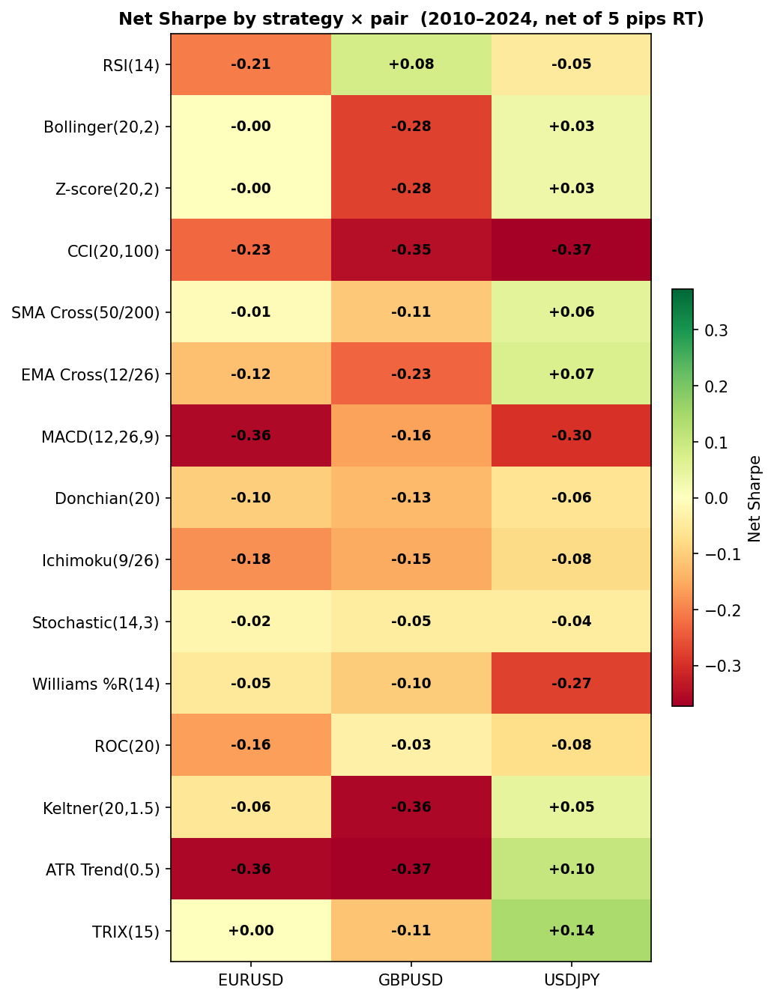
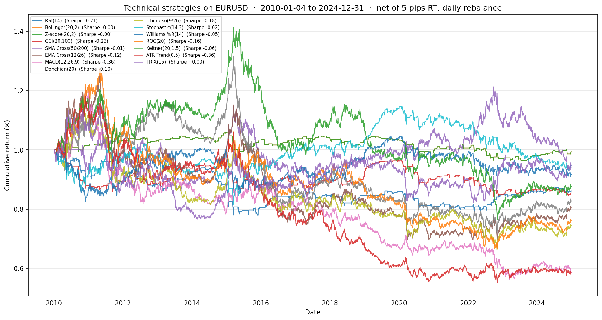
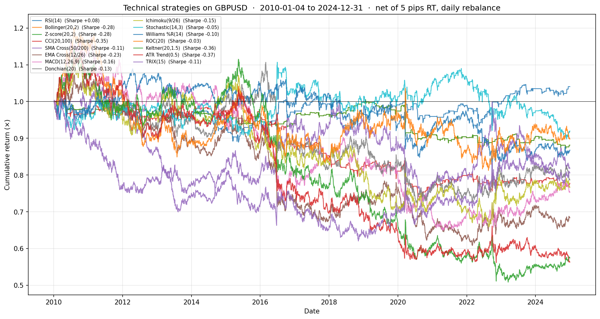
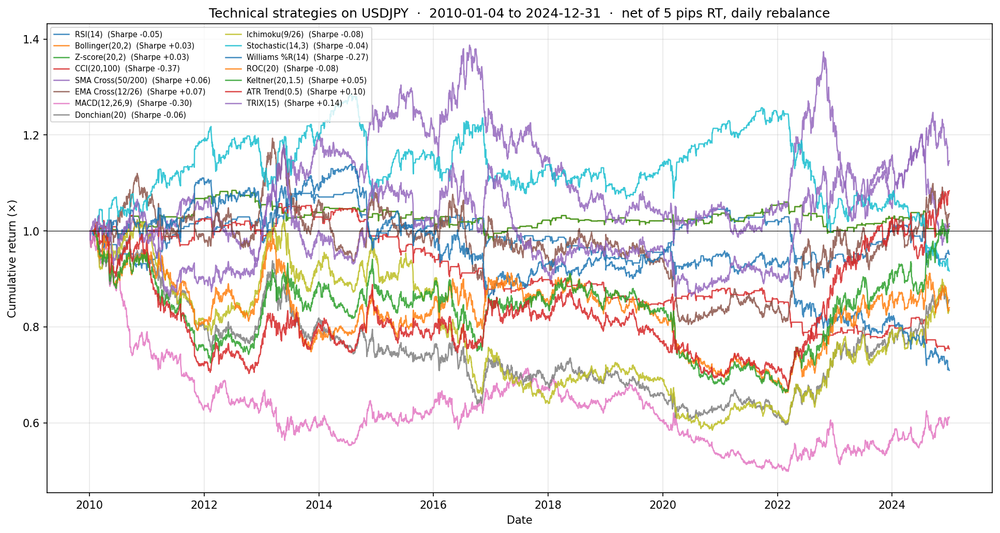

# Technical Strategies — Comparison Sweep

A systematic test of **15 classic single-indicator technical strategies** on the three most-liquid G10 FX majors (EURUSD, GBPUSD, USDJPY). 45 backtests total. Parameters set at canonical defaults from the trading-textbook / EPAT curriculum tradition.

## What this sweep is testing

Whether any of the classic single-indicator rules — RSI, MACD, Bollinger Bands, Donchian, Stochastic, Williams %R, CCI, Ichimoku, etc. — produce a deployable net edge in modern (2010–2024) FX on a daily-rebalance frame.

The honest answer up front: **no, they don't.**

## Setup

- **Period**: 2010-01-04 → 2024-12-31
- **Pairs**: EURUSD, GBPUSD, USDJPY (the three most-liquid G10 majors)
- **Sizing**: position ∈ {−1, 0, +1}, full notional (no scaling)
- **Cost**: 5 pips round-trip charged on turnover
- **Rebalance**: daily close-to-close
- **Pip size**: JPY = 0.01, others = 0.0001

Each strategy is implemented as a daily-position signal function in [`signals.py`](signals.py). The shared backtest engine ([`_base.py`](_base.py)) handles position lag, return calculation, cost on turnover, and metrics. Orchestrator: [`run_all.py`](run_all.py).

## The 15 strategies

| # | Strategy | Family | Logic |
|---|---|---|---|
| 1 | RSI(14, 30/70) | Mean Rev | Long when RSI<30, short when RSI>70, flat in between |
| 2 | Bollinger(20, 2σ) fade | Mean Rev | Long below lower band, short above upper |
| 3 | Z-score(20, ±2σ) | Mean Rev | Long when z<-2, short when z>+2 |
| 4 | CCI(20, ±100) | Mean Rev | Long when CCI<-100, short when CCI>+100 |
| 5 | SMA Cross(50/200) | Trend | Long when 50-day above 200-day ("Golden Cross") |
| 6 | EMA Cross(12/26) | Trend | Long when 12-EMA above 26-EMA |
| 7 | MACD(12/26/9) | Trend | Long when MACD line above signal line |
| 8 | Donchian(20) breakout | Trend | Long on 20-day high, short on 20-day low |
| 9 | Ichimoku(9/26) Tenkan/Kijun | Trend | Long when Tenkan above Kijun |
| 10 | Stochastic(14, 3) | Oscillator | Long when %D<20, short when %D>80 |
| 11 | Williams %R(14) | Oscillator | Long when %R<-80, short when %R>-20 |
| 12 | ROC(20) | Momentum | Long when 20-day return positive |
| 13 | Keltner(20, 1.5×ATR) | Volatility | Long on close above upper Keltner |
| 14 | ATR Trend(0.5) | Volatility | Long when close>SMA20 + 0.5×ATR |
| 15 | TRIX(15) | Momentum | Long when triple-smoothed momentum positive |

## Results — Net Sharpe heatmap



### Net Sharpe table (2010–2024, after 5 pips RT cost)

| Strategy | EURUSD | GBPUSD | USDJPY |
|---|---|---|---|
| RSI(14) | −0.21 | **+0.08** | −0.05 |
| Bollinger(20,2) | −0.00 | −0.28 | +0.03 |
| Z-score(20,2) | −0.00 | −0.28 | +0.03 |
| CCI(20,100) | −0.23 | −0.35 | −0.37 |
| SMA Cross(50/200) | −0.01 | −0.11 | +0.06 |
| EMA Cross(12/26) | −0.12 | −0.23 | +0.07 |
| MACD(12,26,9) | −0.36 | −0.16 | −0.30 |
| Donchian(20) | −0.10 | −0.13 | −0.06 |
| Ichimoku(9/26) | −0.18 | −0.15 | −0.08 |
| Stochastic(14,3) | −0.02 | −0.05 | −0.04 |
| Williams %R(14) | −0.05 | −0.10 | −0.27 |
| ROC(20) | −0.16 | −0.03 | −0.08 |
| Keltner(20,1.5) | −0.06 | −0.36 | **+0.05** |
| ATR Trend(0.5) | −0.36 | −0.37 | **+0.10** |
| **TRIX(15)** | +0.00 | −0.11 | **+0.14** |

### Best per pair

| Pair | Best strategy | Net Sharpe | 2nd best |
|---|---|---|---|
| EURUSD | TRIX(15) | **+0.00** | Bollinger(20,2) (−0.00) |
| GBPUSD | RSI(14) | **+0.08** | ROC(20) (−0.03) |
| USDJPY | TRIX(15) | **+0.14** | ATR Trend(0.5) (+0.10) |

## Per-pair equity curve overlays

- 
- 
- 

## Honest read

**None of these is deployable as a standalone strategy.** 45 of 45 net Sharpes fall below 0.5; 41 of 45 fall below 0 entirely.

The result is **consistent with the academic literature** on technical analysis in FX:
- **Park & Irwin (2007)** — comprehensive survey: profitability of TA rules in major FX largely *disappeared* after the 1990s
- **Neely, Weller & Ulrich (2009)** — TA-based FX returns decayed sharply post-1990
- **Olson (2004)** — declining profitability of moving-average rules in G10 currencies as the markets matured

The hypothesis is that **HFT and algorithmic arbitrage** in liquid FX have erased the slow-moving signals that classic single-indicator rules capture. The same dynamic that killed cross-sectional momentum (see [`../rejected/`](../rejected/)) kills classic technical analysis here.

### Where the small positives concentrate

- **USDJPY** is the only pair with multiple modest positives — TRIX (+0.14), ATR Trend (+0.10), EMA Cross (+0.07), SMA Cross (+0.06), Keltner (+0.05). Plausibly because JPY has had multi-year structural trends (the yen carry trade era 2013–2022, then aggressive depreciation 2022–2024) that trend-following indicators can pick up. But the magnitudes are too small to deploy.
- **GBPUSD** shows a modest RSI positive (+0.08) — mean-reversion possibly survives slightly in GBP due to Brexit-driven episodic volatility.
- **EURUSD** is the most-efficient: not a single positive Sharpe.

### Why we still keep this folder in the repo

This is a **negative-result sweep**, but a *systematic* one. The credibility value:
1. Demonstrates we tested the canonical technical rules and found them empirically lacking — consistent with the literature, not a surprise but worth confirming on the specific 2010–2024 window
2. Provides a baseline against which any future "improved technical" idea (vol-filtered, regime-switched, ML-augmented) can be measured
3. Cross-references the failure mode: classic single-indicator rules don't work, just like cross-sectional momentum doesn't work — both for the same root cause

## What might rescue any of these (untested as of this sweep)

- **Combine multiple indicators** as a confirmation overlay (e.g., RSI + trend filter)
- **Vol-regime filter**: only take signals when realised vol is in a specific band
- **Longer holding periods**: weekly rebalance instead of daily would reduce cost drag
- **Parameter optimisation**: classic defaults may be wrong for 2010-2024 FX (but beware overfitting)
- **Cross-asset signals**: e.g., long USDJPY when US 2Y > JP 2Y AND TRIX positive (rate-diff + trend)

The single most likely to improve results: **wrap any classic indicator as a confirmation filter on top of the rate-diff signal that already works** (Strategies #1–#10).

## Reproducing

```bash
python strategies/technical/run_all.py
```

Outputs go to `reports/technical/`. CSV summary is gitignored; commit only the PNGs.
